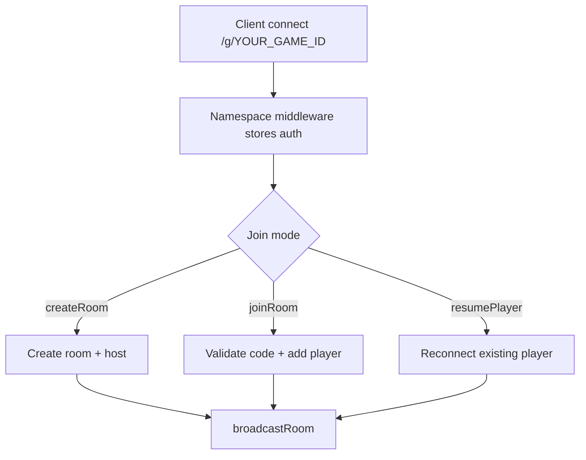
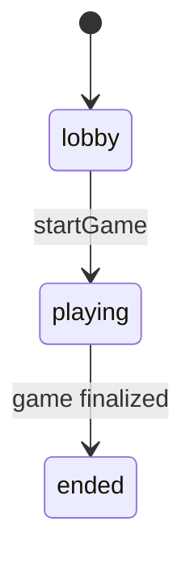

# Your Game - Architecture

## High-level Overview

This project is split into shared contracts, a Socket.IO game server, and a Vue 3 client.

```text
core (shared contracts)
  -> server (authoritative game state + transitions)
  -> ui-vue (rendering + user input + socket events)
```

Key design goals:

- one authoritative room state on the server
- strict shared event and type contracts between client and server
- per-player sanitized room views
- explicit phase state machine

## Shared Core (`core/src`)

Shared modules have no runtime dependencies and are imported by both client and server.

- `types.ts`: room, player, phase models and room view DTOs
- `events.ts`: Socket.IO event contracts (ClientToServer + ServerToClient)
- `constants.ts`: gameplay limits and timing constants
- `index.ts`: shared export surface

## Server Architecture (`server/src`)

### Models

- `models/room.ts`: in-memory room map, session-to-room mapping, cleanup timers
- `models/player.ts`: player factory, socketId to player index mapping

### Managers

- `managers/broadcastManager.ts`: room sanitization and emits
- `managers/phaseManager.ts`: phase transition helpers (`lobby`, `playing`, `ended`)

### Socket Handlers

`handlers/socketHandlers.ts` wires all baseline events for `/g/YOUR_GAME_ID`.

Responsibilities:

- parse handshake auth (`sessionId`, `playerId`)
- validate input and permissions (for example host-only checks)
- mutate room state through handlers/managers
- broadcast sanitized state via `broadcastRoom`

## Vue Client Architecture (`ui-vue/src`)

### State

`stores/game.ts` holds session and room data:

- current `RoomView`
- local player identity (`playerId`, `resumeToken`)
- current `phase`

### Socket Layer

`composables/useSocket.ts` creates the typed Socket.IO connection to `/g/YOUR_GAME_ID`.

### UI Composition

`App.vue` is the phase router. The template includes starter screens:

- `components/Landing.vue`
- `components/Lobby.vue`
- `components/GameOver.vue`

Add your gameplay components and wire them in `App.vue`.

## Socket.IO Event Flow

### Room lifecycle



### Baseline phase state machine



Extend this with your game-specific phases.

## Per-player State Sanitization

All state sent to clients is generated by `broadcastManager`.

Rules:

- remove internal player fields (`resumeToken`, `socketId`)
- hide game-secret information from players who should not see it
- emit `RoomView` data only

## Standalone Runtime Notes

- `standalone-server/src/staticDir.ts` resolves static directory in this order:
  1. `dist/standalone-web`
  2. `dist/client`
  3. `ui-vue` (dev fallback)
- `standalone-server/src/index.ts` serves `/health` and SPA fallback while skipping `/socket.io`.
